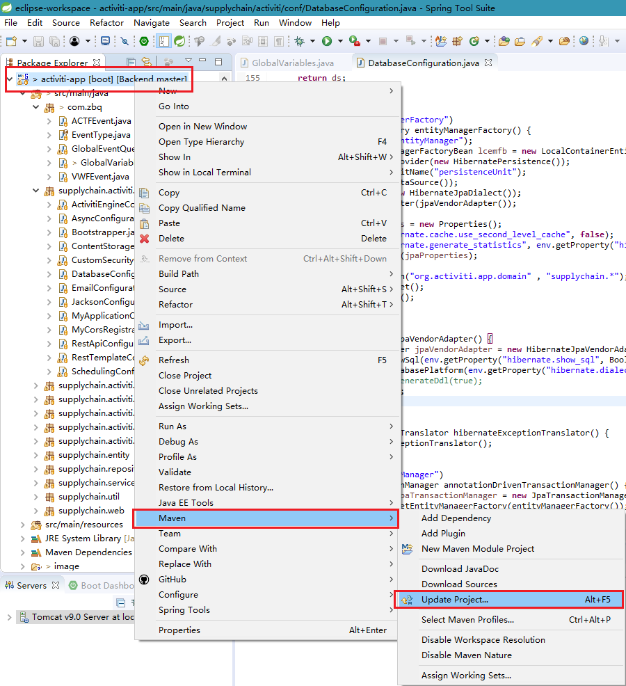
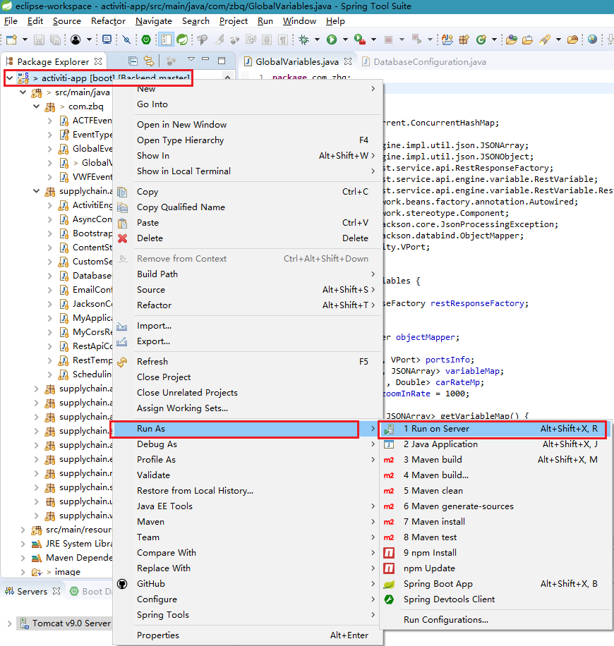
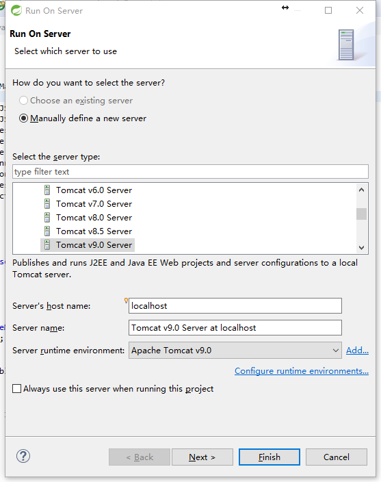

# README
## How to configure and run this project :
1.  Download development tool:

    IDE: [Spring-Tool-Suite-3.9.0.RELEASE](https://spring.io/tools/sts/all)
    Web Container: [Tomcat](http://tomcat.apache.org/)
    Database: [Mysql](https://www.mysql.com/)

2.  Download Source Code:

    `git clone git@github.com:sonnyhcl/Backend.git`

3.  Import Project:  

    To import Backend as a Maven project in STS, follow the steps below :
    `File -> Import -> Maven -> Existing Maven Projects -> Select Root Directory -> Finish`

4.  Update Maven Dependencies:

    Right click the project name `activiti-app`, then enter -> `Maven` -> `Update Project`, waiting to load dependencies.
    

5.  Configure Tomcat:

    After loading is completed, right-click the project name, followed by `Run As `-> `Run On Server` -> `choose Tomcat Server` -> `Finish`.

    

    

6.  Configure Mysql

    First make sure you have installed mysql. You can edit your own mysql tablename/username/password [here](https://github.com/sonnyhcl/Backend/blob/master/src/main/resources/META-INF/activiti-app/activiti-app.properties)

7.  Run Activiti

    Visit [https://localhost:8080/activiti-app](https://localhost:8080/activiti-app) in the browser, enter the login page,
    ```
    username: admin
    password: test
    ```
    

8.  Develop:

    After running the project and logging in  the system , upload process models under the root directory `src/main/resources`, such as `Supply_Chain_pool.bpmn`, `Weagon_Test.bpmn`, then create app for it  and publish your app, then  go to processes page to start the selected process.


> Attention: In order to perform well, The `Backend` project must be coordinated with the `Frontend` project.
